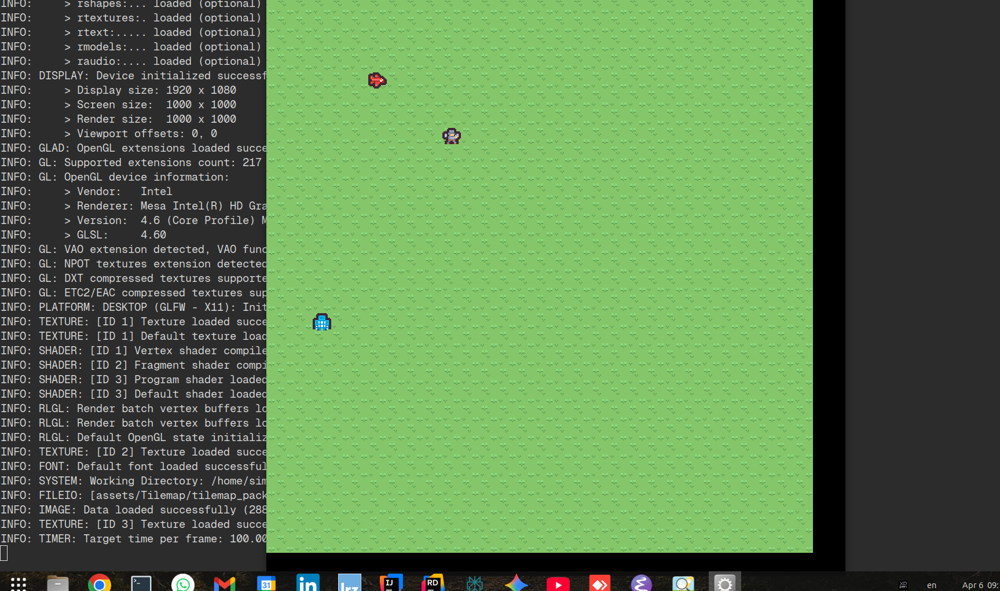

# Strategio - a small fun raylib game

## Credits
This uses the template by [samet404](https://github.com/samet404/meson-raylib) found [here](https://github.com/samet404/meson-raylib).

## Setting up
Native builds:
```sh
$ meson setup build
$ meson compile -C build
```

## Rendering tilemap
### First attempt of rendering the entire tilemap


### Rending a self desigend field and some characters

